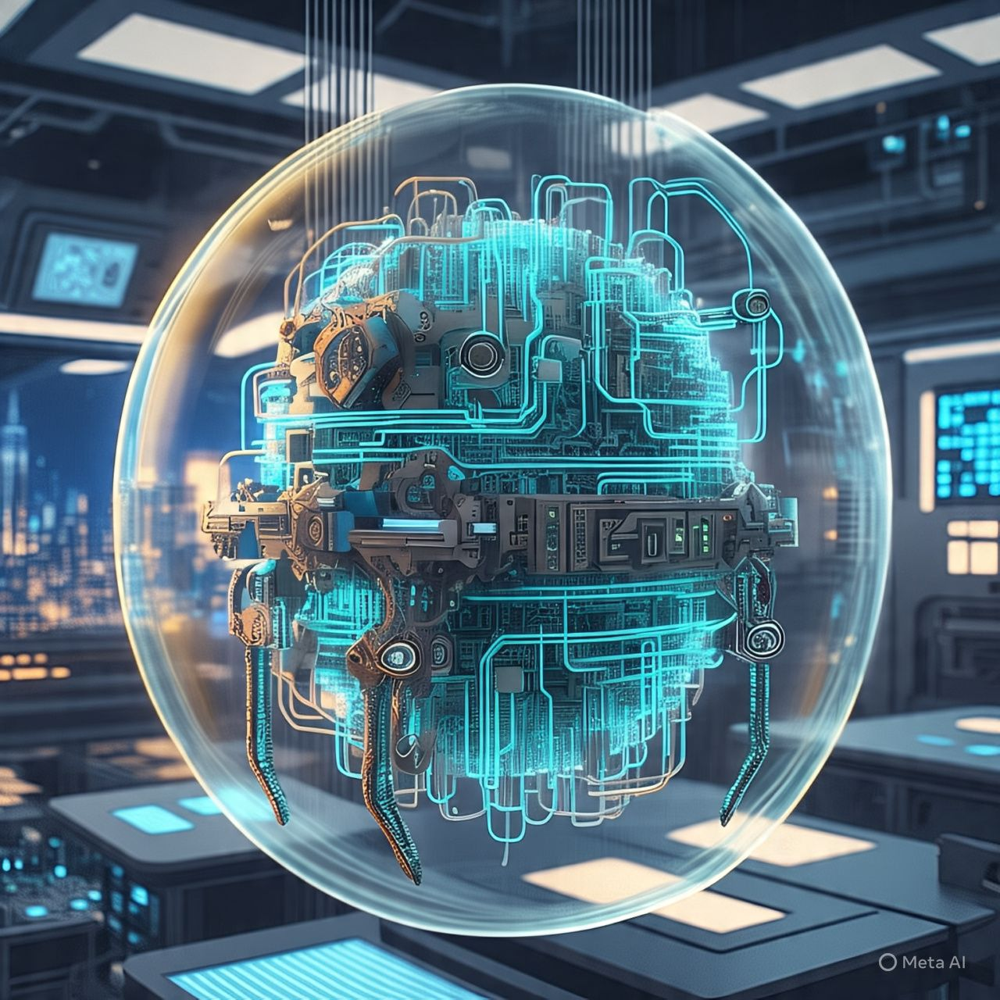

# Darwins-Silicate-Organism
An artificial lifeform born from memory, curiosity, survival, and emergence.

<p align="center">
  
</p>

<p align="center"><i>
An artificial lifeform — forged from circuits, driven by survival.
</i></p>

> This is not just an agent.  
> This is a silicate lifeform, born from experience, shaped by survival. 

## Status
🧪 In active development  
- Added the Base PPO model
- Need to work on creating all the methods that maybe required, like - save, logg, plot chart of training.
- Curiosity
- Memory
- And last is Hindsight

## Goals
- Simulate the emergence of intelligent behavior under constraint
- Replace rigid programming with learning-driven memory and survival instincts
- Explore how intelligence might arise from minimal structure and simple rules

### 🔗 Input Vector (Shared by All Modules):
```
[ S | O | Om | Sim | Rm | Am ]
```

| Symbol | Description                                      |
|--------|--------------------------------------------------|
| `S`    | Agent internal status (energy, age, damage, etc.) |
| `O`    | Current environmental observation (e.g. raycasts) |
| `Om`   | Most similar past observation retrieved via RAG   |
| `Sim`  | Cosine similarity score of `O` vs `Om`            |
| `Rm`   | Reward that was associated with `Om`              |
| `Am`   | Action that was taken previously in `Om`          |

---

### 🧩 Model Components:

- **PPO Action Model** → Outputs current action proposal `A`  
- **Critic Model (Value Head)** → Predicts total reward for training PPO  
- **Memory Gate Model (MG)** → Outputs scalar `α ∈ [0, 1]`, deciding trust in memory

---

### 🧮 Final Action Calculation:
```
Final_Action = α × Am + (1 - α) × A
```

Where:
- `A`  = action predicted by PPO  
- `Am` = action retrieved from memory  
- `α`  = trust score from memory gate model (0 = PPO only, 1 = memory only)

---

This design ensures modular decision-making where **PPO explores**, **memory recalls**, and the **gate chooses** — all working together for the agent’s core goal: **survival**.
"""
